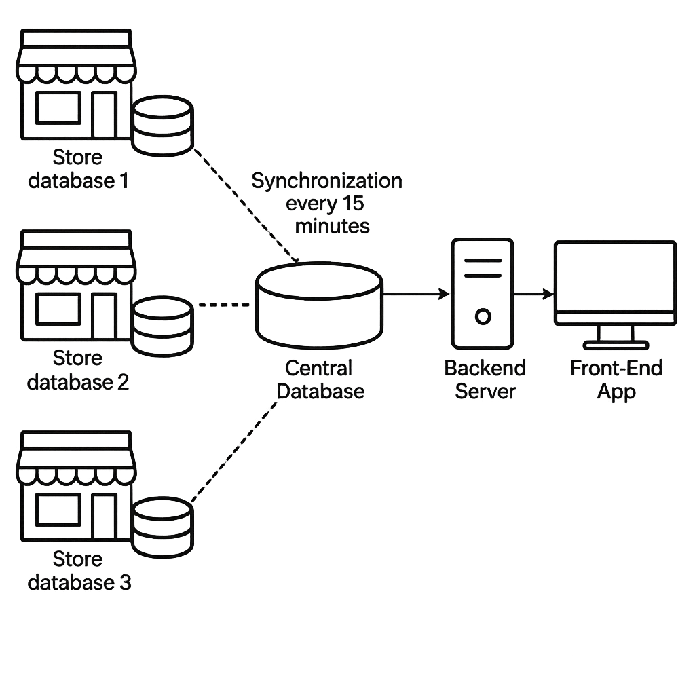
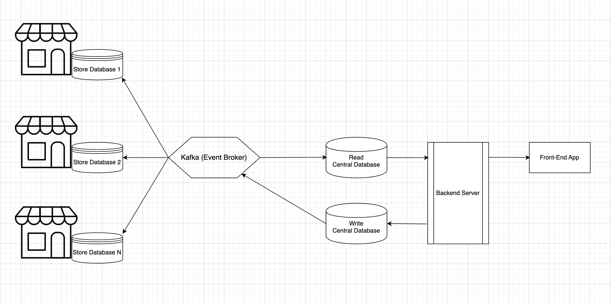

# Distributed Inventory

## Problem

### Context
The original system prioritized **Availability** and **Partition Tolerance**: each store could operate locally even if disconnected. However, **Consistency** was lost, as databases only synchronized every 15 minutes, creating severe stock discrepancies.

### Interpretation
According to the **CAP theorem**, we cannot guarantee Consistency, Availability, and Partition Tolerance simultaneously. To mitigate this limitation, the solution splits trade-offs between **writes** and **reads** applying CQRS design pattern.


---

## Solution



### Writes (Commands)
- **Centralized through a transactional database / command pipeline**.  
- Ensures **Consistency** and **Partition Tolerance**.  
- **Availability is sacrificed**: if the central writer fails, writes will temporarily stop.  
- Rationale: stock operations (purchases, returns, reservations) must be consistent to prevent double-booking or data corruption.  

### Reads (Queries)
- **Served via read replicas or caches** synchronized asynchronously through Kafka.  
- Ensures **Availability** and **Partition Tolerance**.  
- **Consistency is sacrificed**: replicas may lag behind the master by a few milliseconds.  
- Rationale: compared to the previous 15-minute delay, millisecond-level staleness is acceptable for user experience.

### Fault Tolerance
- **Idempotent operations**: retries never cause duplicate updates.  
- **Conflict resolution**: simultaneous stock reservations are handled deterministically.  
- **Reservation mechanism**: stock can be reserved for a limited period before purchase completion.  

### CQRS + Kafka
This design follows the **CQRS pattern**:  
- **Commands (writes)** → Strongly consistent, centralized, partition-tolerant.  
- **Queries (reads)** → Highly available, partition-tolerant, eventually consistent.  

Kafka provides:  
- Reliable event distribution.  
- Low-latency replication.  
- Replayability for recovery and fault tolerance.  

By applying **Kafka + CAP theorem trade-offs + CQRS**, this architecture:  
- Reduces synchronization latency from **15 minutes → milliseconds**.  
- Guarantees **consistent stock updates**.  
- Provides **highly available reads** across distributed stores.

### Consistency and Availability Decision
- **Writes**: prioritize **Consistency + Partition Tolerance (C+P)**. If dependencies fail (DB/Kafka), commands return **503** or **409** on version conflicts.
- **Reads**: prioritize **Availability + Partition Tolerance (A+P)**. Projections can lag by milliseconds; the API exposes lag metadata.


## Architecture
- **Command-side (source of truth)**: transactional database that processes validated commands and persists domain state. Uses the **Outbox Pattern** to atomically persist domain events.
- **Event backbone (Kafka)**: distributes domain events to multiple consumers reliably; topics have DLTs for quarantine and replay.
- **Query-side (read model)**: projections/materialized views are updated asynchronously from Kafka and exposed via read APIs for fast, scalable reads.
- **Transactional DB** (command-side): aggregates, idempotency records, outbox table.
- **Read DB/Cache** (query-side): projections like `AvailabilityView`, `ProductTotalView` tuned for fast reads.


---

## API Design

### Common Headers
- `Authorization: Bearer <token>`
- `Idempotency-Key: <uuid>` (required on all write endpoints)
- `If-Match: <version>` (optional optimistic locking on aggregates)
- `X-Trace-Id: <opaque>` (optional observability)

### Basic Commands
- `POST /v1/purchase` — purchase a product without specifying store; the system picks a store by policy  
  Body:
  ```json
  { "sku":"A1", "qty":1, "customerId":"c1", "policy":"highest-available" }
  ```
  Policies: `highest-available` (default) | `lowest-latency` | `round-robin`.

- `POST /v1/products` — create a product and place `initialOnHand` in the lowest-stock store  
  Body:
  ```json
  { "sku":"A2", "name":"New Product", "initialOnHand":10 }
  ```

### Commands (Write API)
- `POST /v1/adjustments` — relative stock adjustment (delta)  
  Body:
  ```json
  { "storeId":"S1", "sku":"A1", "delta":-3, "reason":"sale", "traceId":"..." }
  ```

- `POST /v1/items:set-absolute` — absolute recount (set onHand)  
  Body:
  ```json
  { "storeId":"S1", "sku":"A1", "onHand":120, "countRef":"cycle-2025-09-26" }
  ```

- `POST /v1/reservations` — create reservation with TTL  
  Body:
  ```json
  { "storeId":"S1", "lines":[{"sku":"A1","qty":2}], "ttlSeconds":900, "customerId":"c1" }
  ```

- `POST /v1/reservations/{reservationId}:confirm` — confirm reservation (decrement onHand)  
  Body:
  ```json
  { "paymentRef":"..." }
  ```

- `POST /v1/reservations/{reservationId}:cancel` — cancel reservation (release reserved)  
  Body:
  ```json
  { "reason":"timeout|user_cancel|payment_failed" }
  ```

- `POST /v1/transfers` — transfer stock between stores (mini-saga)  
  Body:
  ```json
  { "fromStore":"S1","toStore":"S2","lines":[{"sku":"A1","qty":5}], "traceId":"..." }
  ```

- `POST /v1/reconciliations` — back-office snapshot reconciliation  
  Body:
  ```json
  { "storeId":"S1","snapshotOnHand":{"A1":100,"B2":0}, "source":"legacy_sync" }
  ```


### Queries (Read API)
- `GET /v1/availability?sku=A1[&storeId=S1]` — global availability or filtered by store  
  Response headers: `X-Projection-Lag-ms`, `ETag`.

- `GET /v1/items/{sku}/availability` — availability breakdown per store

- `GET /v1/products/totals` — list all products with global totals (no per-store breakdown)  
  Query params: `q`, `page`, `size`.

- `GET /v1/reservations/{reservationId}` — reservation status

- `GET /v1/events?storeId=&sku=&since=` — domain events (debugging)

### Nice-to-have Operations
- `GET /health`, `GET /ready`, `GET /metrics`
- `GET /v1/projections/status`, `POST /v1/projections/rebuild`
- `GET /v1/idempotency/{key}`
- `GET /v1/dlt`, `POST /v1/dlt/replay`


### Glossary

- **sku**: unique product identifier, e.g., `"A1"`.
- **storeId**: identifier of a store/branch.
- **delta**: relative stock change. Negative on sale, positive on restock.
- **onHand**: physical units in store (not subtracting reservations).
- **reserved**: units held temporarily by reservations (not yet sold).
- **available**: `onHand - reserved`; this is what should be exposed to users.
- **countRef**: label for a physical recount or audit cycle.
- **reservationId**: identifier returned when a reservation is created.
- **ttlSeconds**: reservation time-to-live in seconds.
- **policy**: store-selection strategy for `POST /v1/purchase`.
- **Idempotency-Key**: required header on writes for safe retries.
- **If-Match**: header carrying expected aggregate version; prevents blind overwrites.
- **X-Projection-Lag-ms**: read response header that exposes staleness (in ms).
- **ETag**: read response header for projection version caching.
- **version**: aggregate version used for optimistic locking.
- **traceId**: correlation id for distributed tracing.


### Fault Tolerance and Recovery

- **Idempotency**: all write endpoints require `Idempotency-Key`. The service stores the first response per key and replays it on retries.
- **Optimistic Locking**: when `If-Match` is present and the aggregate version changed, the service returns **409 Conflict** with the current version so the client can retry.
- **Outbox Pattern**: state changes and events are committed atomically; an outbox relay publishes to Kafka with retries and backoff. Failed publishes surface in an operator endpoint.
- **Dead Letter Topics (DLT)**: any message that cannot be processed (schema, retries exhausted) goes to `*.dlt`. Operators can inspect and replay.
- **Projection Rebuild**: read models can be rebuilt by replaying the event log (`POST /v1/projections/rebuild`).
- **Circuit Breakers and Readiness**: when dependencies are down, the command API responds with **503** and a `Retry-After`. The read API continues to serve the last projections.


### Kafka Topics and Keys

- `stock.events` (key = `{storeId}:{sku}`) — guarantees order per item-store
- `reservation.events` (key = `{storeId}:{reservationId}`)
- `transfer.events` (key = `{transferId}`)
- `stock.projections` (optional, compacted snapshots)
- `*.dlt` for each topic

Schema evolution should be additive. Events include `eventType`, `eventVersion`, and `occurredAt`.

---

## Quickstart

1. Start your service at `http://localhost:8080` (implementation or stubs following the OpenAPI).
2. Import the OpenAPI spec and the Postman collection provided in this repository.
3. Run the smoke script to validate the end-to-end flow.

### Smoke Tests
```
chmod +x ./smoke-tests.sh
./smoke-tests.sh
# Optional variables:
# BASE_URL=http://localhost:8080 TOKEN=devtoken SKU=A1 STORE=S1 ./smoke-tests.sh
```

### Example cURL
```
# Read availability
curl 'http://localhost:8080/v1/availability?sku=A1'

# Purchase without store (policy-based)
curl -X POST 'http://localhost:8080/v1/purchase'   -H 'Content-Type: application/json'   -H 'Authorization: Bearer devtoken'   -H 'Idempotency-Key: 11111111-1111-1111-1111-111111111111'   -d '{ "sku":"A1","qty":1,"customerId":"c1","policy":"highest-available" }'

# Create product into lowest-stock store
curl -X POST 'http://localhost:8080/v1/products'   -H 'Content-Type: application/json'   -H 'Authorization: Bearer devtoken'   -H 'Idempotency-Key: 22222222-2222-2222-2222-222222222222'   -d '{ "sku":"A2","name":"New Product","initialOnHand":10 }'
```

---

## Performance evaluation

- Synchronization latency reduced from minutes to milliseconds by event-driven projections.
- Conflicts on concurrent updates detected via optimistic locking.
- Fault tolerance via outbox, DLTs, replay, and rebuild of projections.
